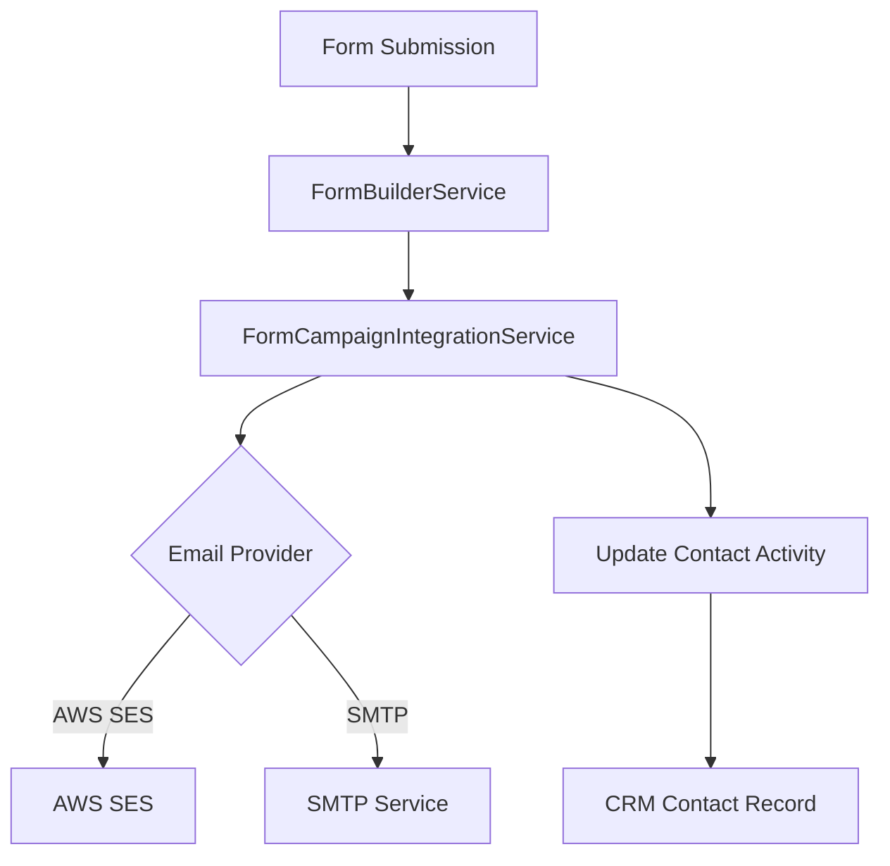

# Axolop CRM - Integration Documentation

## Overview
This document describes how the different sections of the Axolop CRM work together seamlessly to provide a comprehensive customer relationship management solution. The core components include forms, email campaigns, and activities that are interconnected to provide a unified experience for managing customer interactions.

## Core Integration Points

### 1. Forms & Email Campaigns Integration

#### Form-to-Campaign Connection
- **Form Submissions as Campaign Recipients**: When users submit forms, their contact information is automatically captured and can be used as recipients for email campaigns
- **Lead Scoring Integration**: Forms can be configured with lead scoring rules that determine how qualified a lead is, which affects campaign targeting
- **Automated Campaign Triggers**: Forms can trigger automated email campaigns based on specific form responses

#### API Endpoints for Form-Campaign Integration
- `GET /api/email-marketing/recipients/forms/:formId` - Retrieve form submissions as potential campaign recipients
- `POST /api/email-marketing/campaigns/:campaignId/add-form-recipients/:formId` - Add form submissions to an email campaign
- `GET /api/email-marketing/campaigns/:id/stats/by-form` - Get campaign statistics broken down by form source

#### Configuration Example
```javascript
// Example: Creating a form that triggers a welcome email campaign
{
  "title": "Newsletter Signup",
  "questions": [
    {
      "id": "email",
      "type": "email",
      "title": "Your Email",
      "required": true
    },
    {
      "id": "interest",
      "type": "multiple-choice",
      "title": "What are you interested in?",
      "options": ["Marketing", "Sales", "Support"],
      "required": false
    }
  ],
  "integrations": [
    {
      "type": "EMAIL_CAMPAIGN_TRIGGER",
      "config": {
        "campaign_id": "welcome-campaign-123",
        "conditions": {
          "interest": ["Marketing", "Sales"] // Only send if interested in Marketing or Sales
        }
      }
    }
  ]
}
```

### 2. Forms & Activities Integration

#### Activity Creation from Forms
- **Automated Activity Logging**: Form submissions can automatically create activities in the CRM to track customer interactions
- **Task Generation**: Based on form responses, the system can create follow-up tasks for sales representatives
- **Call Tracking**: Phone number fields in forms can link to call logging functionalities

#### Example Use Case
- A lead fills out a contact form expressing interest in a product
- The system creates an activity in the lead's record
- A follow-up task is created for the sales team
- The lead is added to a relevant email campaign based on their responses

### 3. Email Campaigns & Activities Integration

#### Campaign Response Tracking
- **Email Interaction Activities**: When contacts open emails, click links, or respond, activities are automatically created in their contact record
- **Lead Status Updates**: Based on email engagement, lead statuses can be automatically updated
- **Workflow Triggers**: Email campaign interactions can trigger further workflows in the CRM

#### Event Tracking
- Email open events
- Link click events
- Reply events
- Unsubscribe events
- Bounce events

## Technical Implementation

### Service Architecture
The integration is implemented through several services:



### Database Relations
- `forms` table connects to `form_responses`
- `form_responses` connect to `campaign_emails` via `form_id`
- `campaign_emails` connect to `contacts` via `recipient_email`
- Activity tracking via `activities` table linked to contacts and form responses

## AWS SES Integration

### Configuration
The email service uses AWS SES when the following environment variables are set:
- `AWS_ACCESS_KEY_ID` - AWS access key ID
- `AWS_SECRET_ACCESS_KEY` - AWS secret access key
- `AWS_REGION` - AWS region (defaults to us-east-1)

### Fallback Mechanism
If AWS SES is not configured, the system falls back to SMTP configuration:
- `EMAIL_HOST` - SMTP server
- `EMAIL_PORT` - SMTP port
- `EMAIL_USER` - SMTP username
- `EMAIL_PASS` - SMTP password

## Security & Permissions

### RBAC (Role-Based Access Control)
- Forms and campaigns are tied to user accounts
- Users can only access their own forms and campaigns
- Admins can access all resources

### Data Privacy
- Email addresses and personal information are encrypted
- PII is handled according to GDPR and CCPA compliance standards
- Audit logs track all access to sensitive data

## Real-World Scenarios

### Scenario 1: Lead Qualification Flow
1. A visitor fills out a "Product Interest" form on the website
2. The form has lead scoring configured where certain answers increase the lead score
3. If the lead score is above a threshold, they're automatically added to a high-value prospects email campaign
4. An activity is created in the CRM to notify sales of the qualified lead
5. If the lead opens and clicks emails, their status is updated in the CRM
6. A follow-up task is created for the sales team

### Scenario 2: Event Registration
1. A user registers for a webinar via a form
2. They're automatically added to the event campaign list
3. Pre-event emails are sent with details
4. Post-event follow-up emails are sent based on attendance (tracked via email open rates)
5. Activities are logged for each email interaction
6. The lead is moved to the "Engaged Prospects" stage in their sales pipeline

### Scenario 3: Support Request
1. A customer fills out a support form
2. Their request creates an activity in the CRM
3. If they indicated high urgency, they're added to a priority follow-up campaign
4. The support team receives email notifications
5. As they interact with follow-up emails, their support ticket status updates
6. All interactions are logged as activities on their contact record

## Best Practices

### For Developers
1. Always validate form responses before processing
2. Use proper error handling when integrating with external services
3. Implement rate limiting for email sending
4. Monitor email sending metrics and bounce rates
5. Log errors for debugging and analytics

### For CRM Administrators
1. Regularly review and clean up inactive forms
2. Monitor campaign performance and adjust targeting
3. Set up proper lead scoring rules based on historical data
4. Create meaningful activity templates for different scenarios
5. Regularly audit automation workflows to ensure they're working as expected

## Monitoring & Analytics

### Key Metrics to Track
- Form conversion rates
- Email open rates by form source
- Click-through rates by form source
- Lead qualification rates from different forms
- Campaign performance by form source
- Activity completion rates

### Dashboard Integration
- Real-time form submission tracking
- Campaign performance by form source
- Lead score distribution from different forms
- Email engagement metrics by form source

## Troubleshooting

### Common Issues
- Email delivery problems (check SES sandbox mode)
- Form integrations not triggering (check API endpoints)
- Data not syncing between systems (verify database connections)
- Webhooks failing (check endpoint availability and security)

### Debugging Steps
1. Check application logs for error messages
2. Verify environment variables are correctly set
3. Test API endpoints independently
4. Ensure database connections are working
5. Validate email templates and content

## Conclusion

The Axolop CRM's integrated approach ensures that every customer touchpoint is captured, tracked, and leveraged to improve business relationships. By connecting forms, email campaigns, and activities, businesses can create seamless experiences that guide leads through the sales funnel while maintaining detailed records of all interactions.

The system is designed for extensibility, allowing additional integrations and features to be added while maintaining the core integration patterns established throughout the platform.